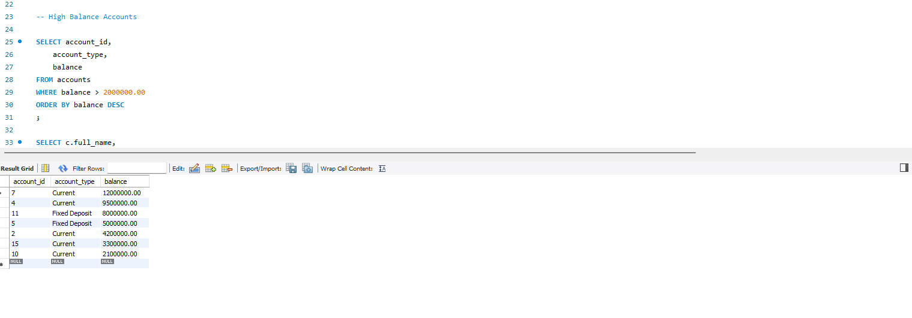
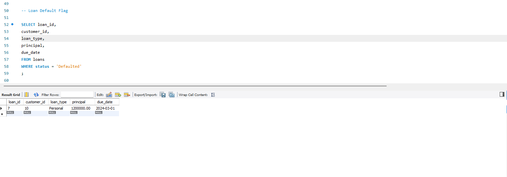
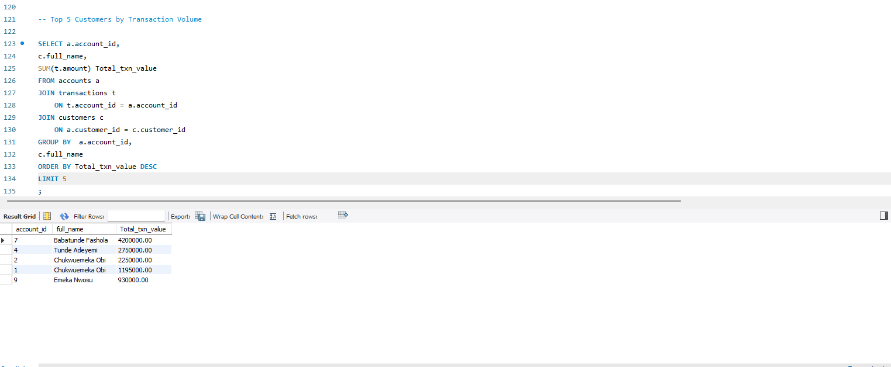

# 🏦 FirstVault Bank — Retail Banking SQL Analysis

An SQL project simulating a real-world data analyst assignment for a Nigerian retail bank. The project covers customer accounts, transactions, branch performance, and loan risk analysis using **MySQL**.

---

## 📁 Project Structure

```
sql-banking-analysis/
│
├── FirstVault_Bank_Analysis.sql   # Schema, seed data, and all queries
└── README.md
```

---

## 📋 Assignment Brief

This project was structured as a simulated SQL assessment from a bank's Data & Analytics team, covering retail banking data for the period **January 2023 – June 2024**. The goal was to answer real business questions across customer behaviour, account activity, and credit risk.

---

## 🗄️ Database Schema

```
branches ──< customers ──< accounts ──< transactions
                  │
                  └──< loans
```

| Table | Description | Rows |
|---|---|---|
| `branches` | Bank branches across Nigerian regions | 7 |
| `customers` | Customer profiles, occupation, and KYC info | 12 |
| `accounts` | Savings, Current, and Fixed Deposit accounts | 15 |
| `transactions` | Credits and debits across multiple channels | 30 |
| `loans` | Personal, Business, Mortgage, and Auto loans | 10 |

---

## 🔍 Analysis Performed

### 🟢 Task 1 — Data Familiarisation
| # | Task | Concepts |
|---|---|---|
| 1 | Customer directory for compliance audit | `SELECT`, column filtering |
| 2 | Active accounts only | `WHERE` |
| 3 | High balance accounts (risk flagging) | `WHERE`, `ORDER BY` |
| 4 | Defaulted loans report | `WHERE` filtering |

### 🟡 Task 2 — Customer & Account Analysis
| # | Task | Concepts |
|---|---|---|
| 5 | Accounts held per customer | `GROUP BY`, `COUNT()` |
| 6 | Customer account summary (active only) | `JOIN`, `WHERE` |
| 7 | Total deposits vs withdrawals | `GROUP BY`, `SUM()` |
| 8 | Customer count per branch | `JOIN`, `COUNT()` |
| 9 | Top 5 customers by transaction volume | Multi-table `JOIN`, `LIMIT` |

### 🔴 Task 3 — Risk & Loan Analysis
| # | Task | Concepts |
|---|---|---|
| 10 | Customers with no loans (cross-sell targets) | `LEFT JOIN`, `NULL` check |
| 11 | Total loan exposure by loan type | `SUM`, `GROUP BY`, `WHERE` |
| 12 | Monthly transaction trend (2024) | `DATE_FORMAT()`, `YEAR()` |
| 13 | High-risk loan customers (rate > 20%, principal > ₦2M) | Multiple `WHERE` conditions |
| 14 | Dormant account compliance report | 3-table `JOIN` |
| 15 | Most used transaction channels | `GROUP BY`, `COUNT`, `SUM` |

---

## 💡 Key Insights

- **Tunde Adeyemi** and **Babatunde Fashola** hold the highest combined account balances, both maintaining Current and Fixed Deposit accounts
- **Transfer** is the dominant transaction channel by both volume and value, followed by Mobile App
- Two accounts were flagged as **dormant**, both belonging to customers who haven't transacted in the review period — a candidate list for reactivation campaigns
- One loan is currently in **Defaulted** status, indicating a need for closer credit monitoring
- **Business loans** carry the highest total exposure among active loan types

---

## 🛠️ Tools Used

- **MySQL 8.0**
- **MySQL Workbench**

---

## 🚀 How to Run

1. Open MySQL Workbench and create the schema:
```sql
CREATE DATABASE firstvault_bank;
USE firstvault_bank;
```

2. Run the `CREATE TABLE` statements to set up all 5 tables

3. Run the `INSERT INTO` statements to seed the data

4. Execute any query from `FirstVault_Bank_Analysis.sql`

---

##📸Query Results

### High Balance Accounts



### Loan Default Flag



### Total Deposits vs Withdrawals


### Top 5 Customers by Transaction Volume


